## FPGA 实现基础的图像处理算法记录
### Requirements
- vivado版本： 2018.4
- Verilog

*前言：读研开始接触FPGA这个东西，本科的时候只是学过一些数电模电，玩过一点单片机这些东西。因为课题会用到，研一选了门 FPGA 的课程，一共也就上了大半学期的课，最后交了个大作业（包含了3个实验设计）就结了课。时间比较短，课上的还是有点懵的，学了一些简单的硬件描述语言语法，当时用的还是 VHDL，使用 ISE 工具在 spartan6 芯片上开发。一开始受到软件编程影响，学 VHDL 的时候，什么信号，实体、构造体、进程，模块连线，状态机...balabala，听得也是稀里糊涂。后面就开始在网上找教程自学 FPGA，跟着教程系统地学习，发现外面基本都是使用 Verilog 语言，也转而使用 Verilog，嗯，比 VHDL 着实用着方便很多，在网上找 Verilog 练习题做，补了一下数电，后来又接触到 ZYNQ，做了点小东西。去年接近年底用 FPGA 搞了几个简单的图像算法，网上相关的帖子也挺多，但写的都不是很细。于是，最近找个周末把当时的设计、仿真记录和代码分享一下~*

### 0、Testbench测试激励编写
用 FPGA 设计图像处理算法一个难的一点在于如何测试编写的模块是否符合要求，比较直观的方法就是直接板上验证，将结果显示在VGA/HDMI的显示器或者TFT彩屏上。不过，这样存在两个问题，一是每测试一次算法都要综合生成比特流烧录程序，相当耗时；二是仅凭直观的定性观察，难以判断算法是否完全符合要求，缺乏严谨。因此，需要进行仿真波形分析。
与软件编程不同，FPGA开发需要编写仿真激励文件。图像处理的 tb 文件的编写又是一个大难题，这是学习 FPGA 图像处理的第一步。采用vivado读取bmp文件模拟行场扫描时序是一个方法，具体流程如下：

<image src = "images/0-1.jpg" width= "40%"><image src = "images/0-2.jpg" width = "20%"><image src = "images/0-3.jpg" width="40%"></image>
*注：读取bmp格式文件，需要了解bmp文件的数据保存格式，见上图。*
图像处理的顶层模块如上图所示，
- 左侧为输入信号：24位rgb数据、输入有效信号（din_vld）、时钟、复位，
- 右侧为输出信号：24为rgb数据、输出有效信号（dout_vld）。

内部各个图像处理模块的结构也如出一辙，测试文件的编写都是对这几个信号进行操作。

**测试激励代码如下：**

```verilog

//=======================================================
//============== top总体输入图像测试 =================
//=======================================================
module tb_top();
reg     clk;
reg     rst_n;
reg  [23:0]   wr_data;
reg     din_vld;
wire    [23:0]  dout;
wire    dout_vld;
//================================ 以下为读写操作内容 =============================

//图像属性：图像宽度 图像高度 图像尺寸 图像像素点起始位
integer bmp_width;
integer bmp_high;
integer bmp_size;
integer start_index;

//bmp file id
integer bmp_file_id;
integer bmp_dout_id;
integer dout_txt_id;

//文件句柄
integer h;
//文件bmp文件数据
reg		[7:0]	rd_data  [0:49300];
reg     [7:0]   rd_data2 [0:49300];

//写操作

integer i = 0;
integer index;
integer j = 0;

parameter CYCLE=20;

always #(CYCLE/2) clk=~clk;
initial
begin
    clk=1'b1;
    rst_n=1'b1;
	din_vld=1'b0;
    #(CYCLE);
    rst_n=1'b0;
    #CYCLE;
    rst_n=1'b1;
    
    //din_vld=1'b0;
	//打开原始图像
	bmp_file_id = $fopen("E:\\MyNewFPGAData\\openfpga\\tbbmps\\myp.bmp","rb");

	//打开输出数据
	dout_txt_id = $fopen("E:\\MyNewFPGAData\\openfpga\\tbtxts\\1119test.txt","w+");

	//读取bmp文件
	h = $fread(rd_data,bmp_file_id);

    // 图像宽度
	bmp_width = {rd_data[21], rd_data[20], rd_data[19], rd_data[18]};
	// 图像高度
	bmp_high = {rd_data[25], rd_data[24], rd_data[23], rd_data[22]};
	// 像素起始位置
	start_index = {rd_data[13], rd_data[12], rd_data[11], rd_data[10]};
	// 图像尺寸
	bmp_size = {rd_data[5], rd_data[4], rd_data[3], rd_data[2]};
	$fclose(bmp_file_id);
    //输出txt
    for(index = start_index; index < bmp_size-2; index = index + 3)begin  //将像素点数据写入txt文件
    	din_vld=1'b1;
        wr_data = {rd_data[index + 2], rd_data[index + 1], rd_data[index]};     //原始rgb数据
        $fwrite(dout_txt_id, "%d,", wr_data[7:0]);
        $fwrite(dout_txt_id, "%d,", wr_data[15:8]);
        $fwrite(dout_txt_id, "%d\n", wr_data[23:16]);
        #(CYCLE);
    end
    din_vld=1'b0;
    $fclose(dout_txt_id);
end

initial
begin
	 #(3*CYCLE);
	//打开输出图像
	bmp_dout_id = $fopen("E:\\MyNewFPGAData\\openfpga\\tbbmps\\sobel1119tb.bmp","wb");//将数据写入bmp
	
	for(i = 0; i < start_index; i = i + 1)begin //写入文件头部信息
        $fwrite(bmp_dout_id, "%c", rd_data[i]);
    end
	
	j=start_index;
	while(j<bmp_size) //写入像素点信息
	begin
		if(dout_vld==1'b1)
		begin
			$fwrite(bmp_dout_id, "%c", dout[7:0]);
			$fwrite(bmp_dout_id, "%c", dout[15:8]);
			$fwrite(bmp_dout_id, "%c", dout[23:16]);
			j=j+3;
		end
		else
		begin
			j=j;
		end
		#CYCLE;
	end
	$fclose(bmp_dout_id);
end

top u0_top(
.clk         (clk),
.rst_n       (rst_n),
.rgb_din     (wr_data),
.din_vld     (din_vld),

.rgb_out     (dout),
.dout_vld    (dout_vld)
    );
endmodule
```
### 1、几个基础的图像处理算法模块设计与效果
分别有 **RGB2GRAY、阈值分割（二值化）、均值滤波、中值滤波、sobel边缘检测、膨胀、腐蚀、开闭运算**。各个模块的结构与上图的顶层模块结构一致，通过模块之间的组合串联组成 ISP 顶层模块。
使用vivado软件，通过测试激励文件可直接读取bmp原图，然后再写出相应的处理后的图像，处理效果如下：
<table>
    <tr>
        <td><center>原图</center></td>
        <td><center>RGB2GRAY</center></td>
        <td><center>阈值分割</center></td>
        <td><center>均值滤波</center></td>
        <td><center>添加椒盐噪点</center></td>
    </tr>
    <tr>
    	<td>
    		<center></center>
    	</td>
    	<td>
    		<center></center>
    	</td>
    	<td>
    		<center></center>
    	</td>
        <td>
    		<center></center>
    	</td>
        <td>
    		<center></center>
    	</td>
    </tr>
    <tr>
        <td><center>中值滤波</center></td>
        <td><center>Sobel</center></td>
        <td><center>膨胀</center></td>
        <td><center>腐蚀</center></td>
        <td><center>闭运算（膨胀->腐蚀）</center></td>
    </tr>
    <tr>
    	<td>
    		<center></center>
    	</td>
    	<td>
    		<center></center>
    	</td>
    	<td>
    		<center></center>
    	</td>
        <td>
    		<center></center>
    	</td>
        <td>
    		<center></center>
    	</td>
    </tr>
</table>

**说明：**
为了便于直观显示处理效果：
- 中值滤波前，对图像先作了添加椒盐噪声的处理；
- 索贝尔运算是在灰度化基础上所作；
- 膨胀运算是在sobel基础上所作；
- 腐蚀运算是在膨胀运算基础上所作；
- 闭运算即先做膨胀后做腐蚀处理

### 2 各个模块设计思路
#### 2.1 RGB2GRAY
将RGB编码数据转化为YCrCb格式，取Y分量叠加即得到灰度图。涉及到浮点数运算，我们先将浮点数扩大一定倍数（左移），再缩小相应倍数（右移），公式如下：

$$
Gray = Y = R*0.299+G*0.587+B*0.114\\
= (R*0.299*256+G*0.587*256+B*0.114*256)>>8\\=(R*77+G*150+B*29)>>8
$$

采用2级流水线设计:

<center>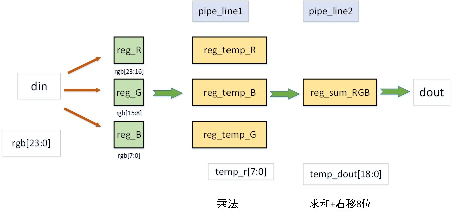</center>

#### 2.2 阈值分割
这里对灰度化后的图像只做了简单的手动设定阈值分割，采用一级流水线结构：

$$
bin\_dout<=(gray_din>THRESHOLD)
$$

<center>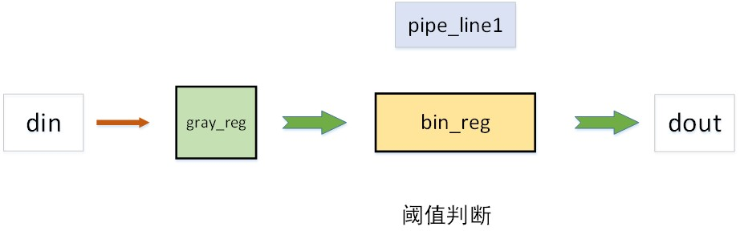</center>

#### 2.3 中值滤波

均值滤波/中值滤波/sobel/腐蚀/膨胀 这些操作属于线性或非线性滤波器，其操作基本差不多，都是归于一个卷积操作，近几年基于FPGA的卷积神经网络加速器设计比较火，里面的一个基本操作也是卷积运算。
卷积运算即通过一个滑动窗口对整幅图像进行处理，处理过程如下图：

<center>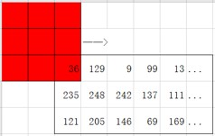</center>

对卷积运算的 FPGA 设计，需要缓存图像的两行像素，我们使用 xilinx 自带的 shift_ram IP核（具体查看xilinx官方文档），将两个shift_ram 模块串联，可以实现对两行像素的缓存，如下图：
<center>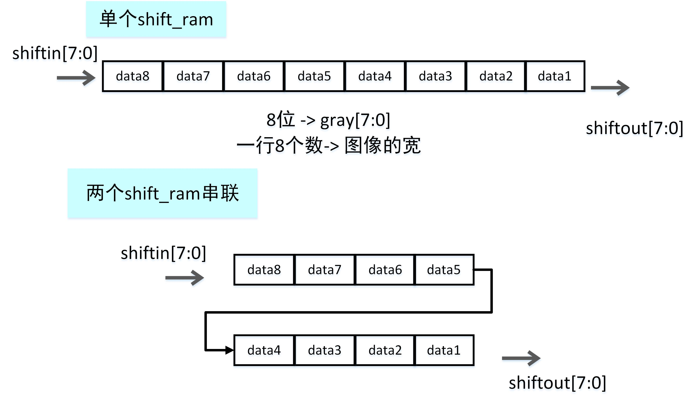</center>

图像数据流操作效果如下，即利用shift_ram缓存两行像素，再使用三个寄存器寄存第三行的3个像素，构成卷积窗口：

<center>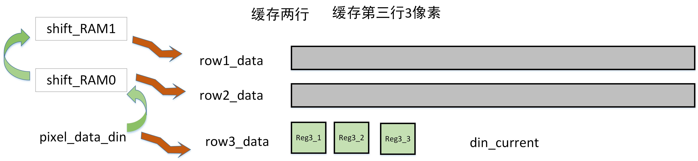</center>

中值滤波是一种非线性滤波器，即对窗口内的像素排列取中值，得到卷积窗口的结果，采用三级流水线的结构设计：1、各行排列得到小中大，2、各列比较，分别取每行最大值的最小值、每行中值的中值、每行最小值的最大值 ；3、上一步得到的三个值取中值。结构如下图：

<center>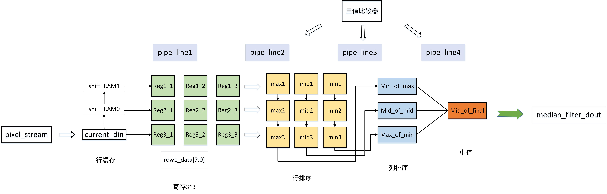</center>


#### 2.4 均值滤波
均值滤波同理，采用三级流水线设计：1、寄存3*3滤波窗口；2、四周8像素累加求和；3、求8像素均值。
操作公式：

$$
pixel\_out = (P_{11}+P_{12}+P_{13}+P_{21}+P_{13}+P_{31}+P_{32}+P_{33})
$$

结构如下：
<center>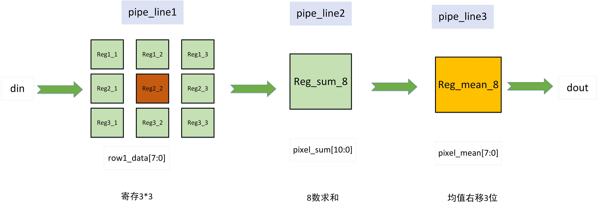</center>

#### 2.5 Sobel边缘检测
sobel算子有x、y两个方向：
<table>
    <tr>
        <td><center>Sx</center></td>
                <td><center></center></td>
                        <td><center></center></td>
                        <td><center></center></td>
                                <td><center>Sy</center></td>
                                        <td><center></center></td>
                                                <td><center></center></td>
    </tr>
    <tr>
        <td><center>-1</center></td>
        <td><center>0</center></td>
        <td><center>1</center></td>
        <td><center></center></td>
        <td><center>-1</center></td>
        <td><center>2</center></td>
        <td><center>-1</center></td>
    </tr>
        <tr>
        <td><center>-2</center></td>
        <td><center>0</center></td>
        <td><center>2</center></td>
        <td><center></center></td>
        <td><center>0</center></td>
        <td><center>0</center></td>
        <td><center>0</center></td>
    </tr>
        <tr>
        <td><center>-1</center></td>
        <td><center>0</center></td>
        <td><center>1</center></td>
        <td><center></center></td>
        <td><center>1</center></td>
        <td><center>2</center></td>
        <td><center>1</center></td>
    </tr>
</table>

采用4级流水线结构：
- 寄存3*3窗口
- 求单行、列系数乘积之和
- 求各方向梯度
- 求总梯度（绝对值和近似均方根）

<center>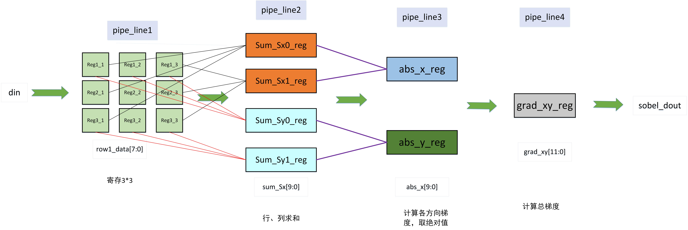</center>

#### 2.6 腐蚀/膨胀
腐蚀/膨胀操作，如下图所示
<center>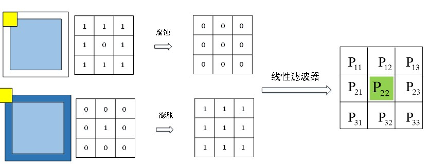</center>
我们将其转化为位运算：

腐蚀：

$$
P = P_{11}\&P_{12}\&P_{13}\&P_{21}\&P_{22}\&P_{23}\&P_{31}\&P_{32}\&P_{33}
$$

膨胀：

$$
P = P_{11} |P_{12}|P_{13}|P_{21}|P_{22}|P_{23}|P_{31}|P_{32}|P_{33}
$$

采用2级流水线结构：
<center>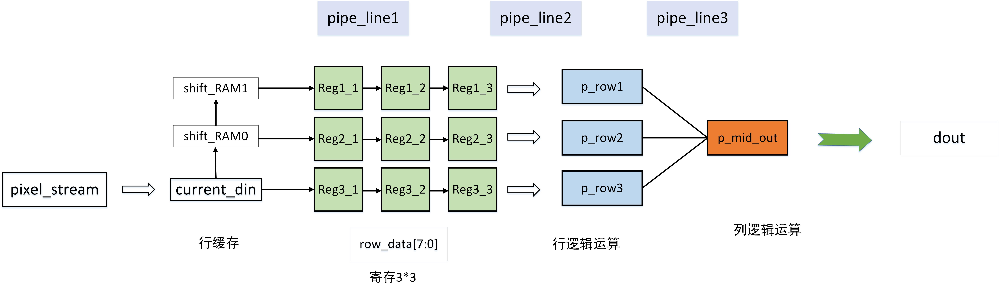</center>

#### 2.7 代码见vivado工程文件
<br/>
### 3、仿真
**以rgb2gray2sobel串联模块为例进行行为仿真**

<center>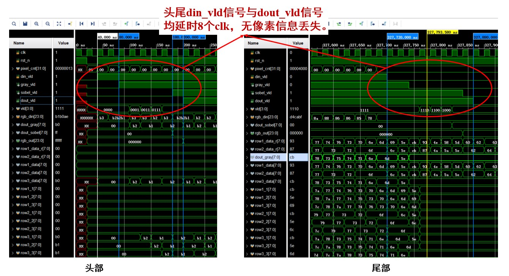</center>

检查波形图头尾，数据有效信号均延时8个clk，无像素信息丢失。
<br/>

<center>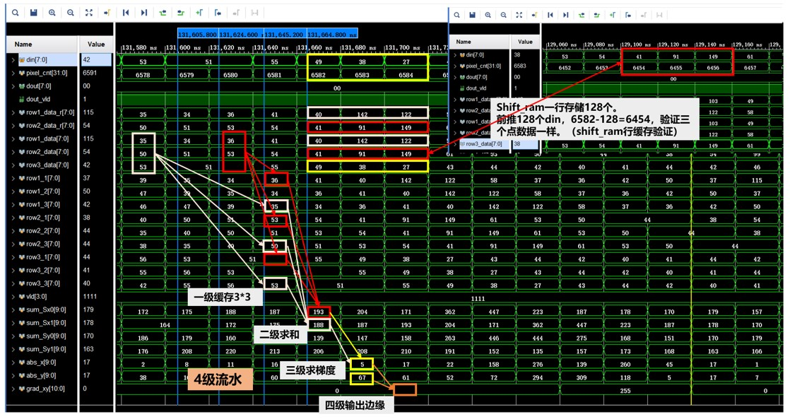</center>

上图为检查sobel卷积运算的数据波形图。

<br/>
#### 待补充...